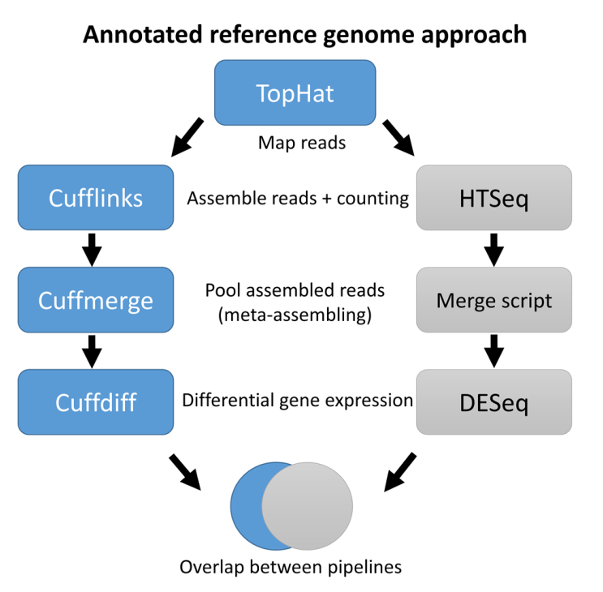

# Pipeline RNA-seq 

Pipeline used in my [PhD thesis](https://kups.ub.uni-koeln.de/6786/) and in the paper [Oka et al., 2017](https://genomebiology.biomedcentral.com/articles/10.1186/s13059-017-1273-4). This pipeline used two different methods to call differentially expressed genes: <span style="background-color:blue; color:white"> Cufflinks </span> and <span style="background-color:grey; color:white"> DESeq </span>.

Here an overview of the pipeline with its two methods to assess differential expression (Cufflinks and DESeq methods in blue and grey, respectively):





## Read trimming

Use [Trimmomatic](http://www.usadellab.org/cms/uploads/supplementary/Trimmomatic/TrimmomaticManual_V0.32.pdf).
Trim reads at both ends (LEADING and TRAILING) based on sequencing quality (Q20) and remove reads that are less than 35 bp after trimming (MINLEN).

```
java -jar trimmomatic-0.33.jar SE -phred33 <input.fastq> <output.fastq> LEADING:20 TRAILING:20 MINLEN:35

```

## Read mapping

The reads were aligned, allowing 1 mismatch, to the reference genome using TopHat2 (tophat-2.1.1). About 90-95% of the reads should be mapping. If less, there can be contamination or bad sequencing. 


```
# Build genome index (use bowtie 2)
bowtie2-build <file.fa> <prefix>

# Map using tophat2
tophat -p 8 -i 5 -I 60000 -o <output_dir/> \
		--library-type fr-unstranded \
		<bowtie_index/prefix> \ 
		<file.fastq> 

# Bam files should be sorted
samtools sort <file.bam> -o <file.bam>
		
```
Several files are generated including an `accepted_hits.bam` file which will be used in the next step.


### Assess strandeness of the library

Strandeness of the library should be known for the counting step. If you did not get information from your sequencing center, two methods can be used, the first using the RSeQC tool [infer_experiment.py](http://rseqc.sourceforge.net/#infer-experiment-py), the second using IGV (visual approach). These methods used mapped read information (bam/sam file). Inspired from discussion https://www.biostars.org/p/66627/ .

#### RSeQC infer_experiment
```{bash}

# Install RSeQC
pip3 install RSeQC

# Get a bed file with gene annotation
# If format is gff3, convert to bed using BEDOPS tool ( https://bedops.readthedocs.io/)
gff2bed < file.gff > file.bed

# Run infer_experiment
infer_experiment.py -i <file.sorted.bam> -r <file.bed>

```
The output will tell whether the library is paired-end or single end, and whether it is stranded or unstranded, check [documentation](http://rseqc.sourceforge.net/#infer-experiment-py) for interpretation.

##### Paired-end stranded library

```
This is PairEnd Data
Fraction of reads failed to determine: 0.0172  
Fraction of reads explained by "1++,1--,2+-,2-+": 0.4903  
Fraction of reads explained by "1+-,1-+,2++,2--": 0.4925  
 ```
 
##### Paired-end unstranded library

```
This is PairEnd Data
Fraction of reads failed to determine: 0.0072  
Fraction of reads explained by "1++,1--,2+-,2-+": 0.9441  
Fraction of reads explained by "1+-,1-+,2++,2--": 0.0487  
 ```
 
##### Paired-end stranded library

```
This is SingleEnd Data
Fraction of reads failed to determine: 0.0170  
Fraction of reads explained by "++,--": 0.9669  
Fraction of reads explained by "+-,-+": 0.0161  
```
#### IGV


Open the bam file in IGV (need to be sorted and indexed).
```
samtools sort <file.bam> -o <file.sorted.bam> 
samtools index <file.sorted.bam> 
```

Open IGV, load the reference genome (fasta) used for mapping and the gene annotation (can be gff, bed, gtf).

Right-click on the reads, then choose color alignments by first-of-pair strand. Here the example of paired-end stranded library.


We can see that the color is specific to transcript direction: pink and blue for transcripts on + and - strand, respectively. In the case of an unstranded library, the colors should be mixed-up within a transcript.


## Gene expression quantification

Two methods were used for gene expression quantification, one method using Cuffdiff and the other DESeq.

Here the difference as explained from [seqanswer](http://seqanswers.com/forums/showthread.php?t=17678):
> "If you have two samples, cuffdiff tests, for each transcript, whether
> there is evidence that the concentration of this transcript is not the
> same in the two samples.
> 
> If you have two different experimental conditions, with replicates for
> each condition, DESeq tests, whether, for a given gene, the change in
> expression strength between the two conditions is large as compared to
> the variation within each replicate group."

Basically, DESeq allows you to integrate multifactor designs to perform multiple fits while cufflink cannot.


---

### Cufflinks pipeline

The [Cufflinks pipeline](http://cole-trapnell-lab.github.io/cufflinks/) was used for assembling transcripts, calculate differential expression.


#### Cufflink

Assemble transcripts

```
cufflinks -p 8 --library-type fr-unstranded -o <output_dir/> -G <annotation.gff3> <accepted_hits.bam>
```

#### Cuffmerge

Merge assembled transcripts for the different conditions. 

Create a text file with the path of all gtf files generated by cuffdiff
```
vim assemblies.txt

./cufflink/husk_mpi_1/transcripts.gtf
./cufflink/husk_mpi_2/transcripts.gtf
./cufflink/husk_mpi_3/transcripts.gtf
./cufflink/husk_uva_1/transcripts.gtf
./cufflink/husk_uva_2/transcripts.gtf
./cufflink/husk_uva_3/transcripts.gtf
./cufflink/ist_mpi_1/transcripts.gtf
./cufflink/ist_mpi_2/transcripts.gtf
./cufflink/ist_mpi_3/transcripts.gtf
./cufflink/ist_uva_1/transcripts.gtf
./cufflink/ist_uva_2/transcripts.gtf
./cufflink/ist_uva_3/transcripts.gtf
```

Merge the `.gtf.` files together.
```
cuffmerge -o <output_dir/> \
	-g <annotation.gff3> \ 
	-s <reference.fasta> \
	-p 8 \
	assemblies.txt
```


#### Cuffdiff

Get differential expression results. `merged.gtf` file is generated in the previous step and should be located in the `output_dir/` directory. All bam files generated by tophat should be given for each of the conditions (here 3 bio reps for tissue 1 and 2) and separated by commas.

```
cuffdiff -o <output_dir/> \
		-b <reference.fasta> \
		-p 8 \ 
		-L tissue1,tissue2 \
		-u <merged.gtf> tissue1_rep1.bam,tissue1_rep2.bam,tissue1_rep3.bam \
		tissue2_rep1.bam,tissue2_rep2.bam,tissue2_rep3.bam
```

#### CummeRbund

Step to perform in R.

Install and load libaries
```{r}
##Packages to load

# source("http://bioconductor.org/biocLite.R")
# biocLite("cummeRbund")
# biocLite("ggplot2")
# biocLite("GenomicRanges")

library("cummeRbund")
library("ggplot2")
library("Gviz")
```

Upload output files from Cuffdiff
```{r}
cuffdiff_data <- readCufflinks('/dir/to/cuffdir_output_dir/')
```

Get differential expressed genes (DEGs)
```{r}
# Check for diff expressed genes
gene_diff <- diffData(genes(cuffdiff_data))

# Get DEGs based on default p-value threshold (5%)
sig_gene_diff <- subset(gene_diff, (significant == 'yes'))

# Get genes with significant differential expression based on chosen p-value threshold (1%)
sig_gene_diff <- subset(gene_diff, (q_value < 0.01))

# Get subset of genes based on fold-change (in this case, 4-fold change)
sig_gene_diff <- subset(gene_diff, ( abs(log2_fold_change) > 2 & significant == 'yes'))
```

Extract information about DEGs
```{r}
# Check number of DEGs
nrow(sig_gene_diff)

# Get names of the DEGs
name_sig_gene_diff =  getGenes(cuffdiff_data, sig_gene_diff$gene_id)
list_genes = featureNames(name_sig_gene_diff)

# Export table with names of the genes
write.table(list_genes[2], 'list_genes.txt', sep='\t',row.names = F, col.names = T, quote = F)

```

Create a heat-map of the genes
```{r}
csHeatmap(sig_gene_diff, cluster='both')

# Export as pdf
pdf("sig_gene_diff.pdf", family="Helvetica", width=7, height=7)
csHeatmap(name_genes_mpi, cluster='both')
dev.off()
```

Compare the expression of each gene in two conditions with a scatter plot
```{r}
csScatter(genes(cuffdiff_data), 'tissue1', 'tissue2')

# Scatterplot only for DEGs
csScatter(sig_gene_diff, 'tissue1', 'tissue2')
```

Make a volcano plot with a red highlight on significant DEGs (p-value<5%)
```{r}
csVolcanoMatrix(genes(cuffdiff_data))
```

Get density plot showing the distribution of the RNA-seq read counts (fpkm)
```{r}
# All genes
csDensity(genes(cuffdiff_data))

# Only DEGs
csDensity(sig_gene_diff)
```

Get expression plots of a set of genes of interest
```{r}
gene_of_interest <- getGene(cuffdiff_data,'name_genes')
expressionBarplot(gene_of_interest)

# Use a vector if multiple genes
genes_of_interest_IDs <- c("gene1","gene2","gene3")
genes_of_interest <- getGene(cuffdiff_data, genes_of_interest_IDs)
expressionBarplot(genes_of_interest)

```
Check clustering of biological replicates
```{r}
csDendro(genes(cuffdiff_data), replicates=T)
```

---

### DESeq pipeline


DESeq is a R package allowing to test differential expression of genes based on read count. Firstly, reads need to be counted from the bam files generated by Tophat.

#### HTseq

HTseq is a software performing read count on sam/bam files. See [documentation](https://htseq.readthedocs.io/en/release_0.10.0/index.html).

##### Install HTseq

```
#Download on https://pypi.python.org/pypi/HTSeq
#Install according to http://www-huber.embl.de/users/anders/HTSeq/doc/install.html#install

tar -zxvf HTSeq-0.6.1.tar.gz
cd HTSeq-0.6.1/
python setup.py install --user
python setup.py build

#Now, I can import the module from python
#I can run it directly using
python -m HTSeq.scripts.count [options] <alignment_file> <gff_file>
```

##### Counting script

Before performing counting, check if bam files are sorted. If bam files are generated with paired-end read data, `--order=pos` or `--order=name` flag should be added to HTseq command if the reads were sorted by position or by name, respectively. To sort a bam file by position with `samtools sort <input.bam> -o <output.bam>` or by name with `samtools sort -n <input.bam> -o <output.bam>`.

This script check if 4 arguments are given (string != 0), open a bam file generated by TopHat, sort it, count the number of reads using HTSeq with the option -s mo (not strand specific), -t gene (type feature = gene), -i ID (GFF attribute to be used). -t and -i need to be adjusted according to the nomenclature of the gff file used (check to see if gene is indicated in column 3 and ID in attribute column).
To allow faster processing, the gff files can be subset so that only lines with 'gene' feature are kept `awk ' $3 == "gene" { print $0}'  file.gff > file_genes.gff`

Usage HTseq: `Usage: count.py [options] alignment_file gff_file`

```{bash}
# View bam file, sort it, count reads in genes 
# and output count in $output_file
# The output contains two column: gene:ID read_count

if [[ -z $1 || -z $2 || -z $3 || -z $4 ]]
then
    echo "Usage: count.sh <bam file> <gff file> <output file name> <log file name>"
else
	bam_file=$1
	gff_file=$2
	output_file=$3
	log_file=$4

	samtools view $bam_file | \
			sort -T /var/temp -s -k1,1 | \
			python -m HTSeq.scripts.count \
			-s no -t gene -i ID - $gff_file > $output_file \
			2> $log_file 
fi
```

The counting script should be run on each individual bam file and the output files should be merged to give a table containing as many columns as there are samples. This file will be used as input matrix in DESeq.

*Note*: If t


TOFIX: maybe the sorting of the bam file is not correct for paired end reads as HTseq missed many mates
Warning: 18622094 reads with missing mate encountered.


##### Merge counts for all bam files

DESeq takes as input a count matrix (called `cts`) containing in row the genes with their read count and in column the different samples. In addition, DESeq requires a table of sample information (called `coldata`).

[Note](http://bioconductor.org/packages/devel/bioc/vignettes/DESeq2/inst/doc/DESeq2.html#countmat):
> It is absolutely critical that the columns of the count matrix and the rows of the column data (information about samples) are in the same order. DESeq2 will not make guesses as to which column of the count matrix belongs to which row of the column data, these must be provided to DESeq2 already in consistent order.


Example of `cts` file:
```
	husk_mpi_1      husk_mpi_2      husk_mpi_3      husk_uva_1      husk_uva_2      husk_uva_3      ist_mpi_1       ist_mpi_2       ist_mpi_3       ist_uva_1       ist_uva_2       ist_uva_3
AC148152.3_FG001        0       0       0       0       0       0       0       0       0       0       1       0
AC148152.3_FG005        0       0       1       0       4       1       25      22      10      12      3       1
AC148152.3_FG006        0       0       0       0       0       0       1       1       0       3       2       0
```

Read counting is given for 3 genes and 12 samples.

Corresponding `coldata` file:
```	
	tissue	location
husk_mpi_1	husk	mpi
husk_mpi_2	husk	mpi
husk_mpi_3	husk	mpi
husk_uva_1        husk    uva
husk_uva_2        husk    uva
husk_uva_3        husk    uva
ist_mpi_1	ist	mpi
ist_mpi_2	ist	mpi
ist_mpi_3	ist	mpi
ist_uva_1	ist	uva
ist_uva_2	ist	uva
```

This experiment contains 3 biological replicates for 2 tissues (ist and husk) and 2 locations (uva and mpi).

Merging the count files


#### DESeq

Check documentation DESeq

```{r}

source("http://bioconductor.org/biocLite.R")
biocLite("DESeq")
library ("DESeq")

# Import the cts matrix (not gene name is now the row name => required)
counts = read.table ("cts.txt", header=TRUE, row.names=1)

# Upload the coldata file
experiment=read.table ("coldata.txt")

# Make a new countDataSet
cdsFull = newCountDataSet(counts, experiment )

# Normalization between samples (size and dispersion)
cdsFull = estimateSizeFactors( cdsFull )
cdsFull = estimateDispersions( cdsFull )
plotDispEsts( cdsFull, main="DESeq: Per-gene dispersion estimates")

# Principal components biplot on variance stabilized data, color-coded by condition-librarytype
# The principal component is the tissue type while the second is the location (at least for Husk UVA and Husk MPI as IST from both locations are clustered along the first componenent)
print(plotPCA(varianceStabilizingTransformation(cdsFull), intgroup=c("location", "tissue")))

# Fit full and reduced models, get p-values
fit1 = fitNbinomGLMs( cdsFull, count ~ location + tissue ) #full model

# Create a GLM without the factor tissue, which should be null as
# we expect most of the variation coming from the tissue
fit0 = fitNbinomGLMs( cdsFull, count ~ location ) # reduced model


# For each gene, the function calculates a chi-square p value by simply calculating: 1 - pchisq(resReduced$deviance - resFull$deviance, attr(resReduced, "df.residual") - attr(resFull, "df.residual")).

pvalsGLM = nbinomGLMTest( fit1, fit0 )

# Make results table with pvalues and adjusted p-values
# Correction Benjamini & Hochberg (1995) ("BH" or its alias "fdr"). control the false discovery rate, the expected proportion of false discoveries amongst the rejected hypotheses. The false discovery rate is a less stringent condition than the family-wise error rate, so these methods are more powerful than the others.
padjGLM = p.adjust( pvalsGLM, method="BH" ) 

# Erwin merges the table given by fit1 and fit0 to the padjGLM to have everything on the same file. The outcome files contain only p-value but no gene names anymore.
# I need to merge the fit1 to pvalsGLM and padjGLM
# First add an header to pvalsGLM and padjGLM

res = cbind(fit1, padjGLM) #the cbind add automatically as header the name of the file to merge

tab1 = table( "location" = res$padj < .1, "all samples" = padjGLM < .1 )
addmargins(tab1)
# All genes seems to be found in common across locations (in common)

table(sign(fitInfo(cds)$perGeneDispEsts - fitInfo(cdsFull)$perGeneDispEsts))

# Comparison of per-gene estimates of the dispersion, Values in log scale
trsf = function(x) log( (x + sqrt(x*x+1))/2 )
plot( trsf(fitInfo(cds)$perGeneDispEsts),
      + trsf(fitInfo(cdsFull)$perGeneDispEsts), pch=16, cex=0.45, asp=1)
abline(a=0, b=1, col="red3")

write.table(padjGLM, file="GLM_padj.tab", sep="\t") 


# Create a GLM integrating the factors 'location' and 'tissue'
fit1 = fitNbinomGLMs( cdsFull, count ~ location + tissue )


fit0 = fitNbinomGLMs( cdsFull, count ~ location )

# Fit the models
pvalsGLM = nbinomGLMTest( fit1, fit0 )
padjGLM = p.adjust( pvalsGLM, method="BH" )

# The cbind add automatically as header the name of the file to merge
res = cbind(fit1, padjGLM) 

# Export tables
write.table(res, file="GLM_padj2.tab", sep="\t") 

```


TOD: update script for DESeq2

Check documentation for DESeq2 [here](http://bioconductor.org/packages/devel/bioc/vignettes/DESeq2/inst/doc/DESeq2.html)


## Gene overlap

To generate Venn diagram in order to visualize what DEGs are overlapping between conditions, one can use `GeneOverlap` to get the numerical values and then used these values with `VennDiagram`.

### Get overlapping genes
```{r}
source("http://bioconductor.org/biocLite.R")
biocLite("GeneOverlap")
library(GeneOverlap)

# Import subset of DEGs from previous analysis
# Here the file contains 1 column with header 'gene'
DEG_tissue1 = read.table('DEG1.txt', header=TRUE, sep="\t")
DEG_tissue2 = read.table('DEG2.txt', header=TRUE, sep="\t")

# Indicate total number of genes
gs=25000

overlap = newGeneOverlap(DEG_tissue1$gene, DEG_tissue2$gene, genome.size=gs)

# Test significance of the overlap
testGeneOverlap(overlap)

# Export overlap list
write.table(overlap, 'overlap.txt', sep='\t',row.names = F, col.names = F, quote = F)
```

### Generate a Venn Diagram

Here I compare the number of DEGs that overlap between the 2 methods: cuffdiff and DESeq.
```{r}
install.packages('VennDiagram')
library(VennDiagram)

# Create new page to avoid the Venn diagram to superimpose the last plot
grid.newpage()

# Construct the Venn Diagram
draw.pairwise.venn(area1 = 4739, area2 = 7362, cross.area =3116,
				category = c("DESeq", "Cuffdiff"),
				lty = "blank", cat.cex = 1.5, cex= 1.5, 
				fill = c("green", "red"))
			
```


# Author: Johan Zicola


